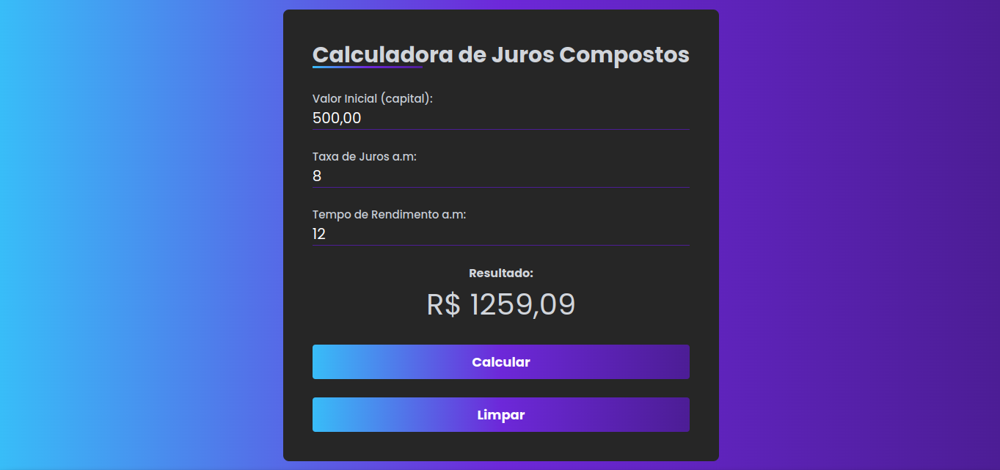

# Calculadora de Juros Compostos

Este projeto implementa uma calculadora de juros compostos utilizando as tecnologias web básicas: HTML, CSS e JavaScript. A interface é intuitiva e permite ao usuário inserir os valores necessários para o cálculo, como capital inicial, taxa de juros e período de tempo.

## Funcionalidades

- Cálculo de Juros Compostos: A calculadora utiliza a fórmula de juros compostos para determinar o montante final do investimento.
- Interface Amigável: O design é simples e fácil de usar, com campos de entrada claros e dois botões, um botão para iniciar o cálculo e outro para limpar os campos.
- Exibição do Resultado: O resultado do cálculo é exibido de forma clara e concisa, informando o montante final acumulado.

## Demonstração

## Como Usar

1. Clone o repositório para sua máquina local.
2. Abra o arquivo `index.html` em seu navegador.
3. Insira os valores nos campos de entrada.
4. Clique no botão "Calcular" para obter o resultado.

## Personalização

Você pode personalizar o gerador editando o arquivo `style.css`. Altere as cores, fontes e outros estilos para criar sua própria aparência.

## Contribuições
Sinta-se à vontade para contribuir com melhorias, correções de bugs ou novas funcionalidades. Basta fazer um fork do repositório e enviar um pull request.
